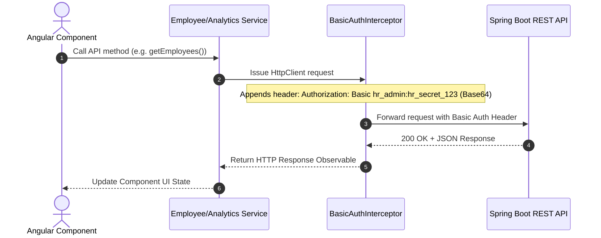
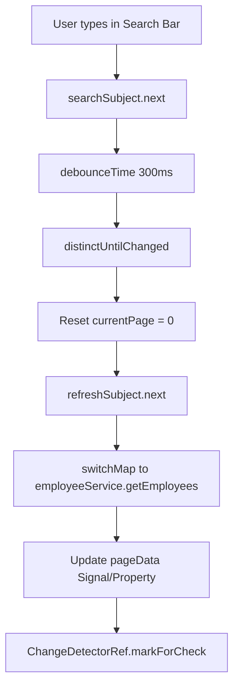

# ACME Salary Management Platform - Frontend Architecture Guide

Welcome to the architectural specification for the **ACME Salary Management Frontend**. This document explains the design, component structure, state management, HTTP interceptors, Leaflet map integrations, and Chart.js analytics of the Angular web application.

> 💡 **For Non-Technical Readers**: Think of the frontend as the **digital dashboard of an electric car**.
> - **Pages / Views** are the different screens on your console (Map Navigation, Employee Directory, Financial Charts).
> - **Services** are the engine sensors that talk to the backend engine to fetch speed, fuel, and status.
> - **Interceptors** are automatic security keycards that clip your access badge onto every outgoing request so you don't have to re-type your password on every button click.
> - **RxJS Streams** are live audio broadcasts—when new data arrives from the server, all screens instantly update in sync.

---

## 1. System Overview & Technology Stack

The frontend application is built using **Angular 17** featuring **Standalone Components**, modern **RxJS 7** reactive streams, **TailwindCSS** for dark-mode aesthetic styling, **Leaflet.js** for interactive GIS map visualization, and **Chart.js** via `ng2-charts` for live analytics dashboarding.

```
+-----------------------------------------------------------------------+
|                           Angular 17 UI App                           |
|                                                                       |
|  +-------------------+  +------------------------+  +--------------+  |
|  |   Home Component  |  |   Employee Directory   |  |  Analytics   |  |
|  |  (Leaflet GIS Map)|  | (Table, Search, Modal) |  | (Chart.js)   |  |
|  +-------------------+  +------------------------+  +--------------+  |
|            |                        |                      |          |
|            +------------------------+----------------------+          |
|                                     |                                 |
|                                     v                                 |
|                        +--------------------------+                   |
|                        |     Angular Services     |                   |
|                        | (Employee, Analytics,    |                   |
|                        |  Map, Seeder Services)   |                   |
|                        +--------------------------+                   |
|                                     |                                 |
|                                     v                                 |
|                        +--------------------------+                   |
|                        |  BasicAuth Interceptor   |                   |
|                        +--------------------------+                   |
+-------------------------------------|---------------------------------+
                                      |
                           HTTP + Basic Auth Headers
                                      v
                        +--------------------------+
                        |  Spring Boot REST API    |
                        +--------------------------+
```

### Core Technologies
- **Framework**: Angular 17 (Standalone Component Architecture)
- **Language**: TypeScript 5
- **Styling**: TailwindCSS 3 + PrimeNG Lara Dark Theme
- **Mapping**: Leaflet 1.9 (CartoDB Dark Basemap Tiles)
- **Charting**: Chart.js 4 + `ng2-charts` 5
- **Icons**: PrimeIcons
- **HTTP Client**: Angular `HttpClient` with RxJS `BehaviorSubject`, `Subject`, `combineLatest`, `switchMap`, and `debounceTime`

---

## 2. Component Architecture & Feature Modules

The application is structured into three primary feature components under `src/app/features`:

```
src/app/
├── core/
│   ├── interceptors/
│   │   └── basic-auth.interceptor.ts
│   ├── models/
│   │   ├── analytics.model.ts
│   │   ├── employee.model.ts
│   │   └── page-response.model.ts
│   └── services/
│       ├── analytics.service.ts
│       ├── employee.service.ts
│       ├── map.service.ts
│       └── seeder.service.ts
└── features/
    ├── home/
    │   └── home.component.ts         (Executive Home & Leaflet GIS Map)
    ├── employee-directory/
    │   └── employee-directory.component.ts (Paginated Table & Modal)
    └── analytics/
        └── analytics-dashboard.component.ts (Chart.js Visual Analytics)
```

### Feature Component Details

1. **`HomeComponent` (`/`)**:
   - Displays executive summary cards (Total Active Headcount, Total Global CTC, Average Salary, Median Salary).
   - Renders an interactive Leaflet GIS World Map centering across 10 global regions (USA, CAN, GBR, DEU, FRA, IND, AUS, JPN, SGP, BRA).
   - Features custom CSS badge callout markers showing live active headcount per country and interactive modal popups breaking down regional CTC spend and average compensation.

2. **`EmployeeDirectoryComponent` (`/employees`)**:
   - Server-side paginated data table displaying up to 10,000 employee records with controls for page size (10, 25, 50, 100) and page navigation.
   - Live debounced search input (300ms RxJS `debounceTime`) filtering by employee name, email, or employee code.
   - Filter dropdown toolbars for Department, Country, and Status (`ACTIVE`, `TERMINATED`, `INACTIVE`).
   - Modal dialog allowing HR administrators to update base pay, deductions, leave allowances, and status.
   - Trigger button for asynchronous 10k batch data seeding.

3. **`AnalyticsDashboardComponent` (`/analytics`)**:
   - Executive visual analytics dashboard rendered with `ng2-charts` / Chart.js.
   - **Department CTC Spend Bar Chart**: Horizontal/vertical breakdown of annual compensation budget by department.
   - **Regional CTC Distribution Pie/Doughnut Chart**: Proportional share of payroll budget across 10 global operating countries.
   - **Salary Distribution Histogram / Bar Chart**: Salary spread ranges highlighting median and mean salary benchmarks.
   - **Top Earners Leaderboard Table**: Top 10 highest compensated executives globally or filtered by selected region.

---

## 3. Data Models & TypeScript Interfaces

Type safety is strictly maintained across all services and components through dedicated TypeScript interfaces in `src/app/core/models`:

```typescript
// Employee Entity Contract
export interface Employee {
  id: number;
  empCode: string;
  firstName: string;
  lastName: string;
  email: string;
  phoneNumber?: string;
  departmentId?: number;
  departmentName?: string;
  departmentCode?: string;
  jobPositionId?: number;
  jobTitle?: string;
  countryCode?: string;
  countryName?: string;
  currencyCode?: string;
  status: 'ACTIVE' | 'TERMINATED' | 'INACTIVE';
  dateOfJoining: string;
  compensation?: Compensation;
}

// Compensation Breakdown
export interface Compensation {
  basePay: number;
  pfDeduction: number;
  otherDeductions: number;
  paidLeavesAllowance: number;
  sickLeavesAllowance: number;
  totalCompanyCost: number;
}

// Executive Summary Model
export interface SalaryAnalyticsSummary {
  totalCompanyCost: number;
  globalAverageSalary: number;
  medianSalary: number;
  activeHeadcount: number;
}

// Regional Analytics Model
export interface CountryBreakdown {
  countryCode: string;
  countryName: string;
  headcount: number;
  averageBaseSalary: number;
  totalCtcSpend: number;
}
```

---

## 4. HTTP Interceptor & Security Integration

All outgoing HTTP requests from Angular are intercepted by `BasicAuthInterceptor` in `src/app/core/interceptors/basic-auth.interceptor.ts`.



```typescript
// BasicAuthInterceptor logic
export const basicAuthInterceptor: HttpInterceptorFn = (req, next) => {
  const credentials = btoa('hr_admin:hr_secret_123');
  const authReq = req.clone({
    setHeaders: {
      Authorization: `Basic ${credentials}`
    }
  });
  return next(authReq);
};
```

---

## 5. Reactive Data Flow & State Management

The frontend utilizes reactive RxJS pipelines to handle user input, debounce API calls, and maintain UI state cleanly without race conditions.



### Key RxJS Patterns Used
1. **Debounced Search**: `searchSubject.pipe(debounceTime(300), distinctUntilChanged())` prevents sending an HTTP request on every keypress.
2. **Cancellation of Stale Requests**: `switchMap()` automatically cancels pending HTTP requests if the user changes page or search query rapidly.
3. **Reactive Re-fetching**: `refreshSubject` acts as a centralized trigger to reload table data whenever filters, pagination, or edits occur.
4. **Error Resilience**: `catchError()` handles network errors or backend restarts gracefully without crashing the UI component tree.

---

## 6. Leaflet GIS Mapping & Chart.js Integration

### Leaflet GIS Map Setup (`HomeComponent`)
- Map container initialized with `L.map('map')` centered at `[20, 0]` with Cartesian bounds.
- Tile layer powered by CartoDB Voyager (`https://{s}.basemaps.cartocdn.com/rastertiles/voyager/{z}/{x}/{y}{r}.png`).
- Dynamic markers stored inside a `L.LayerGroup` (`markersLayerGroup`). When new country breakdown metrics arrive from the backend, existing layers are cleared and recalculated with custom `L.divIcon` badges displaying live active headcount per country.

### Chart.js Dashboard (`AnalyticsDashboardComponent`)
- Chart canvas objects linked via Angular `@ViewChildren(BaseChartDirective)`.
- Updates trigger `chart.update()` inside `setTimeout()` microtasks to force full canvas repaint when dataset properties update.

---

## 7. Running & Building the Frontend

To run the Angular frontend application locally:

```bash
# Install dependencies (if not already installed)
npm install

# Start local dev server (port 4200)
ng serve
```

Access the application in your browser at `http://localhost:4200`.
